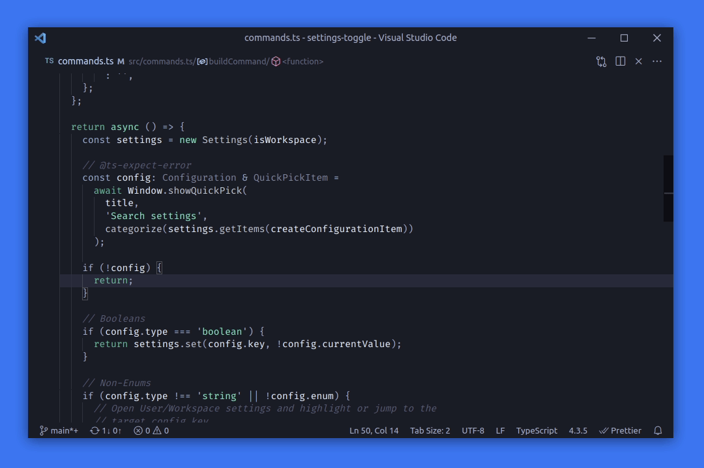

# Settings Toggle for VS Code

Effortlessly Toggle Settings in Visual Studio Code

## Features

- 🔍 Quickly Toggle or open any configuration
- 👀 Preview configuration changes on focus
- 💡 Indicate modification in user/workspace configurations

## Note

Only `boolean` and `enum` configurations can be toggled. Otherwise, the extension will open the native Settings UI (or the JSON Editor if `Workbench > Settings: Editor` is set to `json`) and focus on the target item.

## Commands

- `Toggle: User Settings`: Toggle or jump to any User Setting
- `Toggle: Workspace Settings`: Toggle or jump to any Workspace Setting

## Keyboard Shortcuts

The extension defines the following keyboard shortcuts for the `Toggle: User Settings` command:

- `Cmd+Shift+,` on MacOS
- `Ctrl+Shift+,` on Windows/Linux

## Credits

The logic for parsing VS Code configurations was borrowed from a similar extension called [settings-picker][settings-picker]. Kudos to the author.

The icon was made by [Vitaly Gorbachev][icon-author] from [www.flaticon.com][flaticon]

## License

MIT ©️ [z0al][author]

[settings-picker]: https://marketplace.visualstudio.com/items?itemName=sandy081.settings-picker
[author]: https://twitter.com/_z0al
[icon-author]: https://www.flaticon.com/authors/vitaly-gorbachev
[flaticon]: https://www.flaticon.com/
